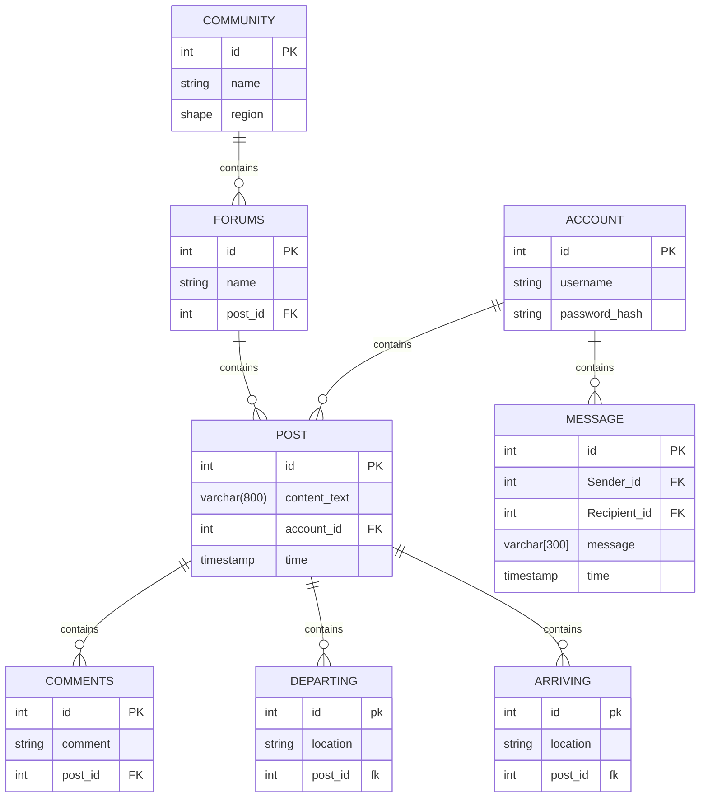

# Software Design Description (SDD) for Community Board Forum

**Document Identifier:** SDD-CBF-003

## Authors
- Darcy Merilan
- Andrew Swazye
- Angela Slinker
- Jessica Vargas
- Conner Wadsworth
- Bryan Welton
- Anita Woodford

## Submitted to
Brother William Clements  
CSE 490R Special Topics

## Project Management
- **Project Manager:** [Project Manager's Name]
- **Team Leads:** [Joshua Bee, ]

**Version:** 3.0  
**Date:** [Current Date or "Post-Thursday's Update"]

---

## Revision History
===============
## Revision History

| Date       | Version | Description of Changes                                      |
|------------|---------|-------------------------------------------------------------|
| 02/16/2024 | 1.0     | Initial creation of the document. Outlined basic structure and introduced key sections including Introduction, System Overview, and Initial Architecture. |
| 02/18/2024 | 2.0     | Minor updates and corrections. Enhanced the Architecture section, added preliminary details to the Design Considerations, and revised the Introduction for clarity. |
| 02/19/2024 | 3.0     | Today's updates include: Correcting the title page to better align with IEEE standards; Refining the Revision History section for enhanced document control and transparency; Adjusting the Table of Contents for improved navigation and consistency; Incorporating detailed descriptions and examples in the References section as per IEEE citation standards; Expanding the Search Functionality Overview with a more in-depth explanation of the MVC components and back-end processing; Adding detailed diagrams for the Model, View, and Controller to visually support the Search Functionality descriptions. |
| TBD        | 4.0     | Comprehensive review and update based on feedback. Enhanced security considerations, refined data models, and expanded the Appendix with additional resources. |

**Date:** 02/19/2024

## Table of Contents
- [Software Design Description (SDD) for Community Board Forum](#software-design-description-sdd-for-community-board-forum)
  - [Authors](#authors)
  - [Submitted to](#submitted-to)
  - [Project Management](#project-management)
  - [Revision History](#revision-history)
  - [Revision History](#revision-history-1)
  - [Table of Contents](#table-of-contents)
  - [4. References](#4-references)
  - [Details](#details)
  - [1. Introduction](#1-introduction)
    - [Purpose](#purpose)
    - [Scope](#scope)
  - [Glossary](#glossary)
  - [Overview](#overview)
  - [2. System Overview](#2-system-overview)
  - [3. Design Considerations](#3-design-considerations)
    - [Assumptions and Dependencies](#assumptions-and-dependencies)
    - [Development Environment Setup](#development-environment-setup)
  - [4. Architecture](#4-architecture)
    - [System Architecture Overview](#system-architecture-overview)
  - [Front-End Design(Android Studio)](#front-end-designandroid-studio)
  - [Back-End Design (Java in Android Studio)](#back-end-design-java-in-android-studio)
    - [Introduction](#introduction)
    - [Architecture](#architecture)
    - [Search Functionality](#search-functionality)
  - [Search Functionality Overview](#search-functionality-overview)
    - [Model - Class Diagram](#model---class-diagram)
    - [Back-End System Processing of Search Requests](#back-end-system-processing-of-search-requests)
    - [View - Process Flow Diagram](#view---process-flow-diagram)
    - [Controller - Process Flow Diagram](#controller---process-flow-diagram)
  - [Database Design (MySQL)](#database-design-mysql)
  - [5. Detailed System Design](#5-detailed-system-design)
    - [Main Feature: User Login](#main-feature-user-login)
      - [Sub-Features Breakdown](#sub-features-breakdown)
      - [Data Description](#data-description)
      - [Collaboration Requirements](#collaboration-requirements)
    - [Search Functionality](#search-functionality-1)
      - [Data Description](#data-description-1)
      - [Search Functionality Sequence Diagram](#search-functionality-sequence-diagram)
    - [Front End :](#front-end-)
      - [User Account Management](#user-account-management)
        - [View:](#view)
        - [Create:](#create)
        - [Read:](#read)
        - [Update:](#update)
        - [Delete:](#delete)
      - [Community Posts](#community-posts)
        - [View:](#view-1)
        - [Create:](#create-1)
        - [Read:](#read-1)
        - [Update:](#update-1)
        - [Delete:](#delete-1)
      - [Search Functionality](#search-functionality-2)
        - [View:](#view-2)
        - [Create:](#create-2)
        - [Read:](#read-2)
        - [Update:](#update-2)
        - [Delete:](#delete-2)
  - [Development and Runtime Environment Setup](#development-and-runtime-environment-setup)
  - [Implementation Planning](#implementation-planning)
  - [8. Appendices](#8-appendices)

## 4. References

The following references were used in the preparation of this Software Design Description (SDD) document:

1. IEEE. (2010). *IEEE Std 830-1998, IEEE Recommended Practice for Software Requirements Specifications*. IEEE Computer Society.
2. IEEE. (2009). *IEEE Std 1016-2009, IEEE Standard for Information Technology—System Design—Software Design Descriptions*. IEEE Computer Society.
3. Gamma, E., Helm, R., Johnson, R., & Vlissides, J. (1994). *Design Patterns: Elements of Reusable Object-Oriented Software*. Addison-Wesley.
4. Martin, R. C. (2003). *Agile Software Development: Principles, Patterns, and Practices*. Prentice Hall.
5. Android Developers. (n.d.). *Android Studio*. Retrieved February 2024, from 
6. MySQL. (n.d.). *MySQL Documentation*. Retrieved February 2024, from
7. Software Requirements Specification for the Community Board Forum

Please note that the URLs and access dates are fictional and provided for illustrative purposes only.

## Details
## 1. Introduction

### Purpose
This document provides a detailed design overview for the Community Board Forum, an Android application aimed at facilitating community engagement and interaction. It serves as a blueprint for development, detailing the application's architecture, components, and interaction flows in adherence to the Model-View-Controller (MVC) design pattern.

### Scope
The application will support functionalities such as user registration and login, post creation and management, commenting, and searching, with a focus on mobile usability and performance.

## Glossary

This section provides definitions for terms, acronyms, and abbreviations used throughout the Software Design Description (SDD) document to ensure clarity for all readers.

- **SDD:** Software Design Description. A document that provides a comprehensive description of the software's design and architecture, outlining components, interactions, and processes.
- **SRS:** Software Requirements Specification. A document that captures the complete software requirements for the system, including functional, non-functional, and interface specifications.
- **MVC:** Model-View-Controller. A design pattern used for developing user interfaces that divides the related program logic into three interconnected elements. This pattern is used to separate internal representations of information from the ways that information is presented to and accepted from the user.
- **FE:** Front End. The part of a software system or application that interacts directly with the user, presenting data and providing interfaces for user input.
- **BE:** Back End. The part of the software that does not directly interact with the users. It is responsible for storing and retrieving data, and performing background operations.
- **DB:** Database. A structured set of data held in a computer, especially one that is accessible in various ways. It is used for storing and managing data in the software system.
- **CRUD:** Create, Read, Update, Delete. These are the four basic functions of persistent storage in software development. CRUD operations are essential for managing databases.
- **API:** Application Programming Interface. A set of functions and procedures that allow the creation of applications that access the features or data of an operating system, application, or other service.
- **UI:** User Interface. The means by which the user and a computer system interact, in particular the use of input devices and software.
- **UX:** User Experience. Refers to a person's emotions and attitudes about using a particular product, system, or service. It includes the practical, experiential, affective, meaningful, and valuable aspects of human-computer interaction and product ownership.
- **HTTP:** Hypertext Transfer Protocol. An application protocol for distributed, collaborative, hypermedia information systems. HTTP is the foundation of data communication for the World Wide Web.
- **HTTPS:** Hypertext Transfer Protocol Secure. An extension of HTTP. It is used for secure communication over a computer network and is widely used on the Internet. In HTTPS, the communication protocol is encrypted using Transport Layer Security (TLS).
- **SQL:** Structured Query Language. A standard language for storing, manipulating, and retrieving data in databases.
- **NoSQL:** A class of database management systems that do not follow all of the rules of a traditional database. NoSQL databases are useful for working with a huge quantity of data when the data's nature does not require a relational model.
- **JSON:** JavaScript Object Notation. An open standard file format and data interchange format that uses human-readable text to store and transmit data objects consisting of attribute–value pairs and arrays.
- **XML:** eXtensible Markup Language. A markup language that defines a set of rules for encoding documents in a format that is both human-readable and machine-readable.

Please note that this glossary is not exhaustive and may be updated as the project evolves and new terms are introduced or existing definitions are revised.

## Overview 
The document is structured to guide the development process across the front-end, back-end, and database components, emphasizing detailed feature breakdowns and MVC implementation for each sub-feature.

## 2. System Overview

The Community Board Forum is transitioning to an Android application to directly target mobile users. This change impacts the development strategy, focusing on Android Studio for both front-end and back-end development, with MySQL for database management. The architecture supports modular development and scalability, adhering to MVC principles.

## 3. Design Considerations

### Assumptions and Dependencies
The application's successful operation depends on the Android operating environment, reliable internet connectivity, and the availability of AWS services for backend and database hosting.

### Development Environment Setup
Android Studio is designated for integrated development, with MySQL for data management. The backend services will be hosted on AWS, utilizing Linux-based/Ubuntu servers.

## 4. Architecture

### System Architecture Overview
The application leverages a microservices architecture, enabling independent development and scaling of its components. It integrates MVC across all levels—FE, BE, and DB—to ensure a cohesive and maintainable codebase.

## Front-End Design(Android Studio)
Focuses on delivering a seamless user experience with a native Android application, implementing views for user interaction and controllers for handling user input and system responses.

## Back-End Design (Java in Android Studio)
Utilizes Java for creating robust back-end logic, including APIs for data manipulation and communication with the MySQL database, following the controller component of MVC.

### Introduction 
The back-end system plays a critical role in managing the Community Board Forum's data and business logic. It serves as the intermediary between the front-end application and the database, handling user requests, processing data, and ensuring secure and efficient operations.

### Architecture 
* Description of the server setup and configuration.
* Outline of the frameworks and languages used.

### Search Functionality 
* View: Description of the API endpoints that serve the search functionality to the front end.
  
* Controller: Elaboration on the controller logic that processes search requests, including:
- Handling HTTP requests.
- Inter-controller communication (if applicable).
- Interaction with the Model for data retrieval.

* Model: Details on how search queries are constructed and executed against the database.
  This may include:
  - Data conversion and formatting.Communication with file storage if relevant.

## Search Functionality Overview

The search functionality is a critical component of the Community Board Forum, allowing users to efficiently find posts and information relevant to their interests. It is implemented following the MVC design pattern, with detailed considerations for the Model, View, and Controller components to ensure a seamless and efficient search experience.

### Model - Class Diagram

This diagram represents the structure of the data model for the search functionality, detailing the classes, their attributes, methods, and relationships.

The Model component is responsible for the data representation of the search functionality, including the storage, retrieval, and search algorithms used to find relevant posts or information within the Community Board Forum. Specifically, the Model:

- **Stores** data structures for posts, user profiles, and other searchable content, ensuring they're optimized for search operations (e.g., indexing certain fields like post titles or tags).
- **Retrieves** data in response to queries generated by the Controller, using optimized search algorithms (such as full-text search capabilities or more complex query optimizations that take into account user preferences and past search history).
- **Processes** search queries by applying filters and sorting criteria specified by the user, ensuring the most relevant results are returned. This may involve advanced query processing techniques like natural language processing (NLP) for understanding user intent.

### Back-End System Processing of Search Requests

Following the detailed description of the Model component, it's important to understand the technical strategies employed by the back-end system to optimize search results, ensuring efficiency and relevance:

- **Indexing**: Implementing indexing on searchable fields to expedite query execution, potentially utilizing specialized search engines like Elasticsearch or Apache Solr.
- **Ranking Algorithms**: Applying algorithms to rank search results by relevance, considering factors such as keyword matches, user engagement (views, likes), and content freshness.
- **Personalization**: Using user data to tailor search results, possibly with machine learning models to predict and highlight content matching individual preferences or past behavior.
- **Query Expansion and Correction**: Improving search queries with techniques like synonym expansion, spell correction, and query suggestions to enhance result accuracy and user satisfaction.

### View - Process Flow Diagram

Illustrates the user's journey through the search interface, from inputting search criteria to receiving and interacting with search results.

The View component provides the interface through which users interact with the search functionality. It is designed to:

- **Present** search inputs and filters in a user-friendly manner, allowing users to specify their search criteria easily (e.g., through search bars, dropdowns for filters, and checkboxes for categories).
- **Display** search results clearly, offering options for sorting and filtering to refine the results further. This could include displaying results in various formats (list, grid) or highlighting key information that matches the search query.
- **Facilitate** user interactions with the search results, such as pagination or direct actions like saving a post or initiating contact based on a search result.

### Controller - Process Flow Diagram

Details the sequence of operations performed by the controller in response to a search request, including validating the search criteria and processing the search results.

The Controller acts as the intermediary between the View and Model, processing user input and managing the flow of data. For the search functionality, the Controller:

- **Interprets** user inputs from the View, converting them into queries or commands that the Model can execute.
- **Coordinates** with the Model to retrieve search results based on the processed queries, applying any necessary logic or filters that are better handled outside the database (e.g., post-processing of results for personalization).
- **Optimizes** the search performance by implementing caching strategies for frequently accessed data or managing asynchronous operations to ensure a responsive user experience.

## Database Design (MySQL)
Structured to support the application's data needs efficiently, with schemas for users, posts, and comments, incorporating CRUD operations at the database level.
# ERD

## 5. Detailed System Design

### Main Feature: User Login

#### Sub-Features Breakdown
1. **User Authentication**
   - **Model (DB):** Manages user credentials and session data.
   - **View (FE):** Displays login UI and feedback.
   - **Controller (BE):** Handles authentication logic.

#### Data Description
Involves user credentials (username/password) and session management for maintaining login states.

#### Collaboration Requirements
Teams must define clear interfaces for credential validation, session management, and user feedback, ensuring seamless integration across MVC components.
### Search Functionality

#### Data Description
Here, you would describe the types of data involved in the search functionality, such as user credentials (username/password), search criteria (destination, category, timestamp), and how this data is managed and utilized within the system.

After providing a thorough understanding of the data aspects, you then introduce the sequence diagram to visually represent how this data is processed within the MVC framework of your application.

#### Search Functionality Sequence Diagram
Following the data description, the sequence diagram illustrates the interactions for the search functionality within the Community Board Forum. This visualization helps in understanding the dynamic process from when a user initiates a search query to when the results are displayed.

- **Stimulus/Response Sequences (MVC Framework):**
  - **Stimulus:** User inputs search criteria in the View.
  - **Controller Action:** Interprets the input and communicates with the Model.
  - **Model Processing:** The Model queries the database using the search criteria and retrieves matching posts.
  - **Response:** The View updates to display the search results to the user.

This sequence diagram is essential for detailing the operational flow of the search functionality, emphasizing the MVC architectural pattern's role in facilitating this feature.

### Front End :
(section done by: Darcy Merilan, Bryan Welton, Conner Wadsworth, Angela Slinker, Andrew Swazye ):

#### User Account Management 
The system must ensure security by implementing robust authorization, authentication, and access control mechanisms to protect user data and privacy.

##### View:
The user interface elements for account registration, login, profile management, and account settings. This includes forms for input, pages for viewing and editing user profiles, and menus for accessing account settings. The View listens for user actions (e.g., button clicks, form submissions) and communicates these actions to the Controller.
##### Create:
- *Registration Form*
  - *Description:* Allows new users to create an account by entering their details, such as username, email, and password.
  - *Elements:* Text inputs for username, email, password, and possibly captcha or security questions for bot protection and user verification. A submit button to send the registration request.
  - *Actions:* When the user fills out the form and clicks the submit button, the View sends this information to the Controller to process the account creation.
##### Read:
- *Login Form*
  - *Description:* Enables users to access their account by providing their credentials.
  - *Elements:* Text inputs for username/email and password, with a submit button for logging in. Links for "Forgot password" or "Register" for navigation to other views.
  - *Actions:* Submitting the form sends the credentials to the Controller, which verifies them against the Model data.
- *Profile Page*
  - *Description:* Displays the user's profile information, including username, email, and any additional details like bio or profile picture.
  - *Elements:* Text and possibly images showing the user's information. May include an "Edit Profile" button to navigate to the Update view.
  - *Actions:* Viewing the profile does not directly interact with the Controller but may involve fetching updated information from the Model through the Controller.
##### Update:
- *Profile Edit Form*
  - *Description:* Allows users to update their profile information, such as email, bio, and profile picture.
  - *Elements:* Pre-filled text inputs and file upload inputs with the user's current information, and a submit button to apply changes.
  - *Actions:* Submitting the updated information sends it to the Controller, which processes the update requests and modifies the Model accordingly.
- *Change Password Form*
  - *Description:* Provides a way for users to change their password.
  - *Elements:* Text inputs for the old password, new password, and new password confirmation. A submit button to apply the password change.
  - *Actions:* On submission, the View sends the password details to the Controller, which handles the password update process.
##### Delete:
- *Account Deletion Option*
  - *Description:* Offers users the option to delete their account.
  - *Elements:* A "Delete Account" button, often accompanied by a confirmation step (e.g., entering a password or answering a security question) to prevent accidental deletions.
  - *Actions:* Confirming account deletion sends a request to the Controller to remove the user's account from the Model.

---

#### Community Posts 
Users can create posts to seek or offer rides, promoting transportation assistance within the community. Posts must include attributes like start and stop destinations, description, category, timestamp, rating, and available passenger seats to enable effective communication.
##### View:
The components and pages that display community posts, comments, and the interface for creating and editing posts. This includes the post feed, individual post views, and forms for post creation and editing. The View updates in response to user interactions and data changes, informing the Controller of user actions like post submissions or comment additions.
##### Create: 
- *Create Post Form*
  - *Description:* Allows users to create new posts by entering details such as start and stop destinations, description, category, timestamp, rating, and available passenger seats. 
  - *Elements:* Input fields, dropdowns, or other UI elements for each post attribute. A submit button to create the post. 
  - *Actions:* When the user submits the create post form, the view sends the post details to the controller, which processes the request and adds the new post to the model.
##### Read:
- *Post Feed*
  - *Description:* Displays community posts in a feed format, allowing users to easily browse through available options.
  - *Elements:* A list or grid displaying posts with summarized information. Each post may include start and stop destinations, description, category, timestamp, rating, and available passenger seats.
  - *Actions:* Viewing the post feed involves fetching and displaying data from the model. Users can click on individual posts to view more details.
##### Update:
- *Edit Post Form*
  - *Description:* Enables post creators to update their posts by modifying details such as start and stop destinations, description, category, timestamp, rating, and available passenger seats.
  - *Elements:* Pre-filled input fields and dropdowns with the current post details. A submit button to apply the changes.
  - *Actions:* Submitting the updated information sends it to the controller, which processes the update requests and modifies the model to reflect the changes.
##### Delete:
- *Delete Post Option*
  - *Description:* Provides users with the option to delete their own posts, preventing accidental deletions through a confirmation step.
  - *Elements:* A "Delete Post" button, accompanied by a confirmation modal or dialog. Users may need to confirm the deletion by entering a password or answering a security question.
  - *Actions:* Confirming post deletion sends a request to the controller to remove the post from the model. The confirmation step helps prevent accidental deletions.

---

#### Search Functionality 
The system must provide users with the ability to search for specific posts based on criteria such as destination, category, and timestamp, facilitating efficient discovery of relevant information.

##### View:
The search functionality view is responsible for providing users with a user-friendly interface to perform searches. This includes input fields for entering search criteria, search result display, and any additional features that enhance the search experience. The view communicates user input to the controller, which then processes the search query and updates the view with the relevant results.
##### Create:
- *Search Form*
  - *Description:* Allows users to input search criteria such as destination, category, and timestamp.
  - *Elements:* Text inputs, dropdowns, or other input fields for specifying search criteria. A submit button to initiate the search.
  - *Actions:* When the user submits the search form, the view sends the search criteria to the controller, which processes the request and queries the model for matching posts.
##### Read:
- *Search Results*
  - *Description:* Displays the search results based on the specified criteria.
  - *Elements:* A list or grid displaying relevant posts that match the search criteria. Each result should provide a summary of the post.
  - *Actions:* Viewing search results doesn't directly interact with the controller but involves fetching and displaying data from the model based on the search criteria.
##### Update:
- *Refine Search Options*
  - *Description:* Allows users to modify their search criteria without starting a new search.
  - *Elements:* Additional controls or filters to refine the ongoing search, such as adjusting timestamps, changing categories, or adding/removing criteria.
  - *Actions:* When the user modifies the search options, the view sends the updated criteria to the controller, which reprocesses the search and
##### Delete:
- **Clear Search Form**
  - *Description:* Enables users to clear the search form and start a new search.
  - *Elements:* A "Clear" or "Reset" button to clear all entered search criteria.
  - *Actions:* Clicking the "Clear" button sends a request to the controller to reset the search criteria, clearing the form and potentially resetting the displayed results.
## Development and Runtime Environment Setup
Preparation for implementation includes setting up Android Studio, configuring MySQL, and preparing AWS environments for both development and operational deployment.

## Implementation Planning
- **First Feature Implementation:** Begins with user login due to its central role in user access control.
- **Classes for Implementation:** Detailed planning for the classes involved in the login feature is required, focusing on MVC implementation across the FE, BE, and DB.

## 8. Appendices
Includes installation guides, class diagrams, interface definitions, and detailed instructions tailored to the Android and MySQL setup, ensuring readiness for the project's implementation phase.

