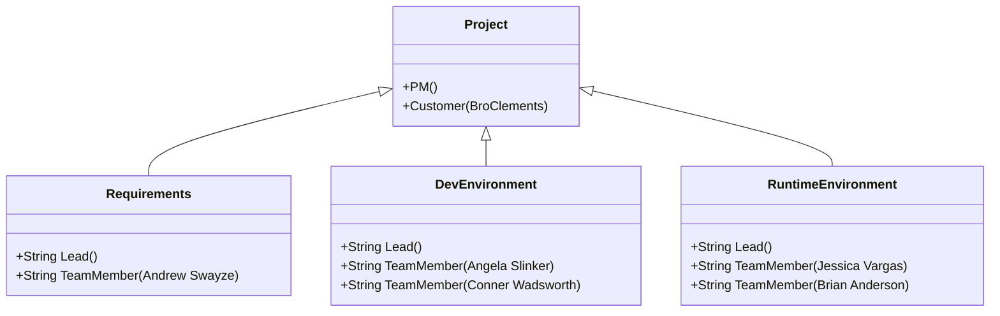
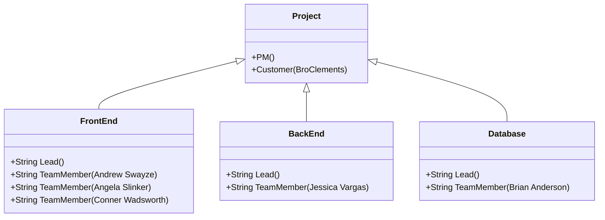

Week 1-2

```mermaid
classDiagram
      Project <|-- Requirements
      Project <|-- DevEnvironment
      Project <|-- RuntimeEnvironment
      Project : +PM()
      Project : +Customer(BroClements)
      class Requirements{
          +String Lead()
          +String TeamMember(Andrew Swayze)
      }
      class DevEnvironment{
          +String Lead()
          +String TeamMember(Angela Slinker)
          +String TeamMember(Conner Wadsworth)
      }
      class RuntimeEnvironment{
          +String Lead()
          +String TeamMember(Jessica Vargas)
          +String TeamMember(Brian Anderson)
      }
```
Rest of the Semester

```mermaid
classDiagram
      Project <|-- FrontEnd
      Project <|-- BackEnd
      Project <|-- Database
      Project : +PM()
      Project : +Customer(BroClements)
      class FrontEnd{
          +String Lead()
          +String TeamMember(Andrew Swayze)
          +String TeamMember(Angela Slinker)
          +String TeamMember(Conner Wadsworth)

      }
      class BackEnd{
          +String Lead()
          +String TeamMember(Jessica Vargas)
      }
      class Database{
          +String Lead()
          +String TeamMember(Brian Anderson)
      }
```
