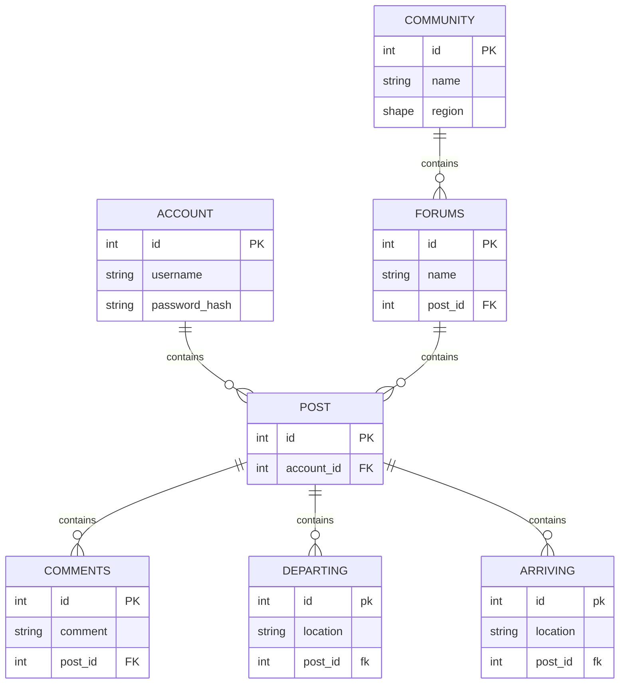



Backend Whitepaper

1-19-24

Joshua Bee, George Krenk, Angela Slinker, Conner Wadsworth, Claudio Parra

Executive Summary

- Java (Android Studio)
- Kotlin (Android Studio)
- Swift (iOS, need a mac to test things, Xcode)
- Dart (android, iOS, webapp, but very difficult, Android Studio)
- PHP (website, VSCode)
- C++ (infrastructure, VSCode)
- Python (BeeWare, cross platform, iOS, android, windows, VSCode)
- Django (python, webapp, VSCode)

Java is commonly used for Android development, providing versatility and widespread adoption. Kotlin, though challenging, offers improved syntax for Android development. Swift is exclusive to iOS and requires a Mac for testing, ensuring a seamless experience. Dart supports Android, iOS, and web apps but is considered complex. PHP is a popular choice for web development, while C++ is often utilized for infrastructure-related tasks. Python, through BeeWare, is cross-platform, supporting iOS, Android, and Windows. Python stands out as an excellent choice due to its ease of learning, making it accessible for individuals unfamiliar with other programming languages. 

Introduction

In the dynamic landscape of programming languages, developers navigate a plethora of options catering to diverse platforms and applications. From Java's ubiquity in Android development to the intricacies of Swift exclusively for iOS, and the versatility of Python spanning cross-platform functionality, each language brings its unique strengths and challenges. This summary aims to shed light on key programming languages such as Java, Kotlin, Swift, Dart, PHP, C++, and Python, offering insights into their respective domains and advocating Python's accessibility as a compelling choice for those venturing into programming for the first time.

Problem Statement 

In the evolving realm of programming languages, developers are presented with a variety of choices, each tailored to specific platforms and functions. This variety, while beneficial, poses a significant challenge in selecting the most suitable language for different development needs. This problem is further compounded by the unique requirements and learning curves associated with each language. From Java's widespread use in Android development to Swift's iOS specificity and Python's cross-platform capabilities, the decision becomes complex, especially for beginners. The challenge lies in balancing the languages' specific strengths with the developer's requirements and skill levels, making it crucial to understand the nuances and applications of each language to make an informed decision. 

Solution Overview

In addressing the diverse programming language options for our backend development, the team has carefully analyzed several languages, considering factors such as ease of use, cross-platform compatibility, and the specific requirements of our project. The comprehensive evaluation has led us to identify Python as the optimal solution for our backend development needs. 

Detailed Analysis

- Java (android studio)

Using Java with Android Studio offers robust debugging capabilities. Android Studio features an integrated Android emulator, which is highly beneficial for developers who may not have access to a physical Android device for testing. This emulator allows for thorough testing of applications in a simulated Android environment, ensuring that any potential issues can be identified and resolved effectively.

- Kotlin (android)

We are not aware of any courses at BYUI that use Kotlin, so it would be new to everyone on the team, which is not necessarily a terrible thing, but it could cause a rougher start, and we would prefer something cross-platform. 

- Swift (iOS, need a mac to test things)

Swift would be a difficult one, because not everyone has a mac. There are workarounds on windows, but it is simpler to just use something else. Also, most of the class might be unfamiliar with Swift, and it is not cross-platform. 

- Dart & Flutter (android, iOS, webapp, but very difficult)

Flutter is cross platform. It is a UI SDK, so it is another tool to learn. It is what makes the application cross platform, while dart is the backend/database. It is a steep learning curve, and for a small project like this, not necessarily the best option. 

- PHP (website)

We can do the backend in PHP, some of us might have experience with it from web backend courses. It integrates well with PostgreSQL, as a database, and you can use any web frontend of course like css, bootstrap, you can also use JS with it. 

- C++ (infrastructure)

This is not the best option, many new students have not learned any C++, and it is a big language to learn. 

- Python (BeeWare, cross platform, iOS, android, windows)

This would work, but with being cross platform, you will have to still tailor things in each version of the application. 

- Web app (vueJS, reactJS, Django (python), Flask (python), angularJS, CakePHP,)

Creating a web app would be the easiest way to create it to be cross platform. Here we have options that are JS based, Python based, and PHP based, and I am sure there are more out there. Django is widely used and has a lot of support available. 

- Case Studies/Real-World Applications Conner Wadsworth

Many companies use Python to develop applications across various domains. Python is a versatile programming language known for its readability, simplicity, and extensive libraries. Some notable companies that use Python for application development include:

Google: Python is one of the main languages used at Google. It is utilized for various purposes, including web development and building internal tools.

Facebook: Python is used at Facebook for various purposes, including backend development, infrastructure management, and data analysis.

Instagram: Owned by Facebook, Instagram also relies on Python for backend services and data analysis.

Dropbox: Python is a key language at Dropbox, used for both server-side and client-side development.

Spotify: Python is used in various aspects of Spotify's development, including backend services and data analysis.

Netflix: Python is used for backend services, automation, and data analysis at Netflix.

Reddit: The backend of Reddit is primarily implemented in Python, utilizing the Django web framework.

NASA: Python is widely used at NASA for scientific computing, data analysis, and mission control systems.

IBM: Python is used by IBM for various purposes, including artificial intelligence, data analysis, and web development.

Quora: Python is used in different parts of Quora's infrastructure, including backend services.

SurveyMonkey: Python is used for web development and backend services at SurveyMonkey.

These are just a few examples, and Python's popularity continues to grow across industries. Its ease of use and extensive libraries make it a preferred choice for many developers and companies.

We will also be implementing Django. I will now list some real world uses for Django in today's industry.

Web Development Agencies: Django is widely used by web development agencies to create dynamic and feature-rich websites and web applications for clients.

E-commerce: Many e-commerce platforms and online shopping websites use Django for building their backend systems. Its ORM (Object-Relational Mapping) system simplifies database interactions, making it suitable for complex e-commerce applications.

Social media: Django is employed in building social networking sites and applications. Its built-in authentication system, security features, and scalability make it a good choice for platforms that involve user interactions and content sharing.

Content Management Systems (CMS): Django is used to create custom CMS solutions. Its admin interface is robust and can be customized to manage and organize content efficiently.

Finance and Banking: Django is utilized in the finance sector for creating applications that handle financial transactions, account management, and other related functionalities. Its security features are particularly important in these applications.

Healthcare: Django is employed in healthcare applications for managing patient records, scheduling appointments, and handling other administrative tasks. Its security and scalability make it suitable for healthcare systems.

Education: Educational platforms and e-learning websites use Django for building applications that manage course content, user profiles, and student interactions.

Government and Public Sector: Django is chosen for government websites and applications due to its security features. It's used in various government sectors for information dissemination and interaction with citizens.

Startups: Many startups choose Django for its rapid development capabilities. It allows startups to quickly build and iterate on their minimum viable products (MVPs) and scale as needed.

Real Estate: Django is used in the real estate industry for building property management systems, listing platforms, and other real estate-related applications.

These are just a few examples, and Django's versatility allows it to be applied in various other industries as well. Its emphasis on the "Don't Repeat Yourself" (DRY) principle and adherence to good software engineering practices make it a popular choice for developers working on a wide range of projects.

- Benefits and Advantages

The benefits and advantages of using Python over the other software languages we had on the table is ease of use, cross-platform functionality, and its ability to function on iOS, android, and Windows.

Python’s ease of use is a great benefit to us as that means those who do not have much experience in programming apps will still be able to learn and move ahead with the project. Python’s ease of use also means that digging through the code for bugs or potential updates will be more intuitive.

Python’s cross-platform functionality using BeeWare will be of the most use to us, as we have yet to set in stone exactly what sort of platform our app will be on. Since Python can work on multiple platforms and function on iOS, android, and Windows, it gives us more options for our app.

- Conclusion

From everything we researched and discussed, we were able to decide as a group that Python would be the best software to use for our development environment. Its ease of use, cross-platform compatibility, and ability in environments like iOS, android, and Windows makes it an excellent choice for our app.

